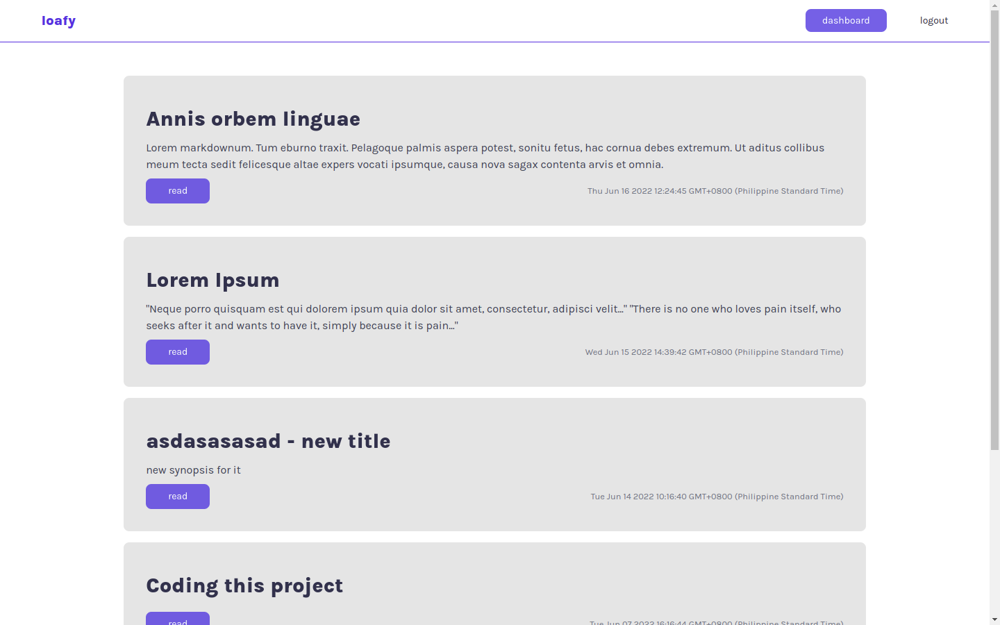

# loafy

Fullstack blogging web app build with Nextjs, Prisma and PlanetScale DB.



## Features

- [x] Full-features markdown editor for creating posts.
- [x] Show all posts and view each.
- [x] Single-user blogging platform.
- [x] Paginated posts.
- [x] Allow default user to change credentials.
- [x] Manage posts (edit and remove).

## Setting up

- Environment variables

```
DATABASE_URL='prisma-db-url'
API_URL='project-web-api'
SECRET_TOKEN='custom-random-token'
```

##

**&copy; 2022 | TheBoringDude**
